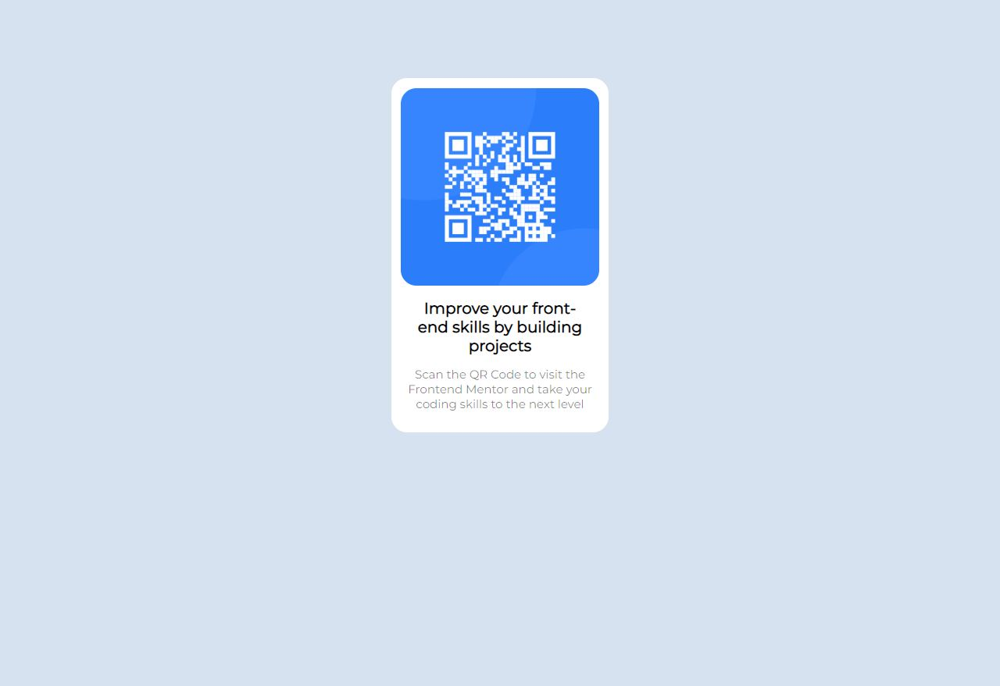
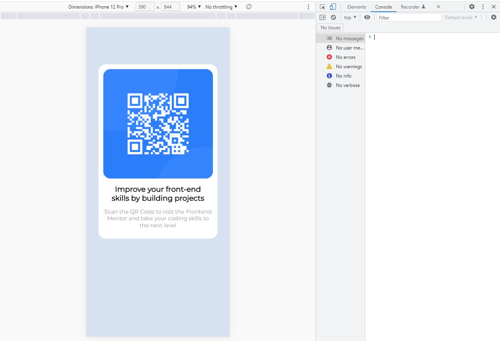

# Frontend Mentor - QR code component solution

This is a solution to the [QR code component challenge on Frontend Mentor](https://www.frontendmentor.io/challenges/qr-code-component-iux_sIO_H). Frontend Mentor challenges help you improve your coding skills by building realistic projects. 

## Table of contents

- [Overview](#overview)
  - [Screenshot](#screenshot)
  - [Links](#links)
- [My process](#my-process)
  - [Built with](#built-with)
  - [What I learned](#what-i-learned)
  - [Useful resources](#useful-resources)
- [Author](#author)

## Overview

### Screenshot

### Links

- Solution URL: [Add solution URL here](https://your-solution-url.com)

## My process

### Built with

- Semantic HTML5 markup
- CSS custom properties
- JavaScript

### What I learned

-With this project, I could solve some problems about the responsive design with the browser and mobile pictures sizes.

The funny thing about this project was that it was simple but I needed to focus more than I was expecting to make a good version of my QR Code based on the templates of the challenge.

### Useful resources

- [Resource 1](https://github.com/k0edb/portfolio/blob/main/Barbearia%20Alura/contato.html) - This project helped me with the responsive design on the box.

## Author

- Website - [Add your name here](https://github.com/k0edb)
- Frontend Mentor - [@yourusername](https://www.frontendmentor.io/profile/k0edb)
